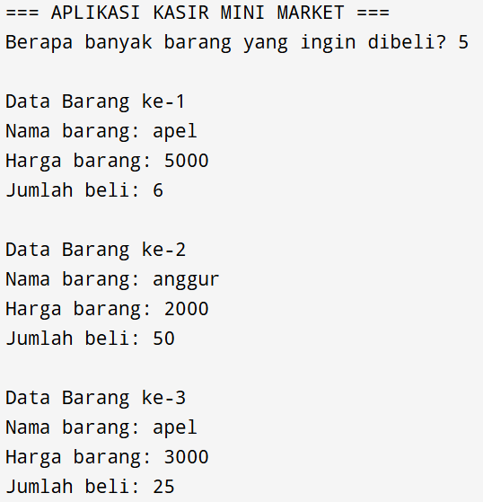

# Kasir-Mini-Market 

## # Kasir Mini Market - Aplikasi Kasir Sederhana

 <!-- Ganti dengan nama file screenshot Anda -->

## Deskripsi
Aplikasi Kasir Mini Market adalah program sederhana yang dibangun dengan C# untuk membantu proses transaksi di mini market atau toko kecil. Aplikasi ini memungkinkan input data barang, perhitungan otomatis, dan pencetakan struk belanja sederhana.

## Fitur Utama
- ✅ Input multi-barang dengan jumlah dinamis
- ✅ Perhitungan otomatis:
  - Subtotal per item (harga × jumlah)
  - Total belanja
  - Kembalian
- ✅ Validasi input:
  - Harga harus angka positif
  - Jumlah harus bilangan bulat positif
- ✅ Tampilan struk belanja
- ✅ Mode transaksi berulang

## Cara Menggunakan
1. Jalankan aplikasi
2. Masukkan jumlah barang yang dibeli
3. Untuk setiap barang, input:
   - Nama barang
   - Harga satuan
   - Jumlah beli
4. Aplikasi akan menampilkan daftar belanja
5. Masukkan uang yang dibayarkan
6. Sistem akan menghitung dan menampilkan kembalian
7. Pilih untuk transaksi baru atau keluar

## Teknologi Digunakan
- C# (.NET Framework)
- Visual Studio (IDE)

## Cara Menjalankan
1. Clone repository ini
2. Buka solusi di Visual Studio
3. Build solusi
4. Run program

## Kontribusi
Silakan fork repository ini dan buat pull request untuk berkontribusi.

## Lisensi
[MIT License](LICENSE)

---
Dibuat oleh Sherlinia Dela 
